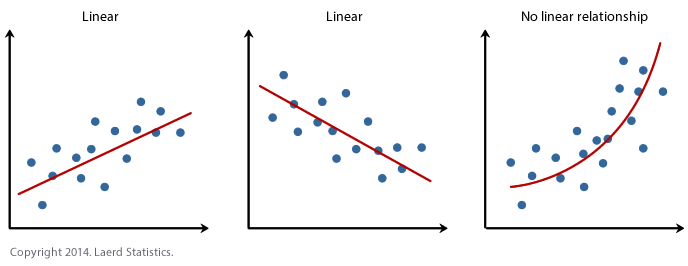

# Simple Linear Regression

Regression is used when you have to predict a continuous value

## What is a Linear Regression model?

These models are used to show or predict the relationship between two  variables
or factors. The factor that is being predicted (the factor the equation solves 
for) is called the dependent variable. The factors that are used to predict the
value of the dependent variable are called independent variables.

## Simple Linear Regression

In this type of regression, each observation consists _two values_. One value is 
for the dependent variable and one value is for the independent variable. A
striaght line approximates the relationship between the dependent variable and 
the independent variable. When two or more independent variables are used in
regression analysis, the model is no longer a simple linear one. That is known 
as multiple linear reg.

### Types of answers you can get on the plot:

- Positive Relationship:    Simply put, if one value increases, other increases
                            as well.
- Negative Relationship:    One decreases, other decreases as well.
- No relationship: A flat line (no slope)

Based on: https://www.thebalancesmb.com/what-is-simple-linear-regression-2296697

